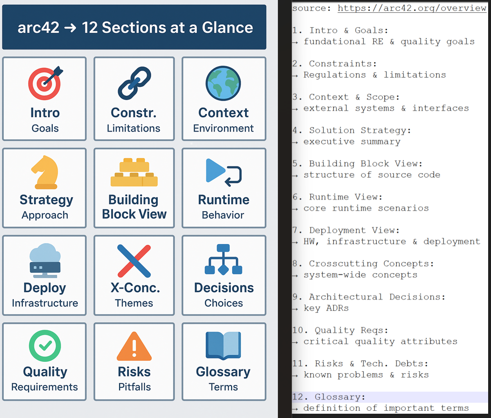

**© 2025 Hamadi Sy. All Rights Reserved. Unauthorized distribution or reproduction is strictly prohibited.**

---

## 🚀 80/20 Principle: The Essential 20% of Requirements Engineering (RE) for Full-Stack Web-Developers to cover 80% of their daily tasks

---

# 🎯 Purpose
The purpose of Architecture Documentation with ARC42 is to provide a structured, comprehensive, and consistent way to document a software system's architecture, enabling effective communication and decision-making among all stakeholders.

---

# 🌱 Origin
ARC42 is a lightweight and adaptable template for software architecture documentation, created by Dr. Gernot Starke and Dr. Peter Hruschka. It was first introduced around the early 2000s, evolving from years of practical experience in documenting real-world software architectures to address common documentation challenges and ensure practicality.

---

# 🧠 Essentials

Focus on understanding and contributing to following core sections:
Source: [Link to ARC2 documentation](https://arc42.org/overview)

* **System Scope and Context**
- What to know: How the system interacts with its environment, external systems, and users. Understand its boundaries and interfaces.
- Why it's essential: Crucial for understanding integration points, dependencies, and the overall role of your system within a larger ecosystem. Helps prevent scope creep and defines what needs to be built vs. what already exists.

* **Building Block View**
- What: The decomposition of the system into logical, deployable, or technical building blocks (modules, components, services) and their relationships. Understand their responsibilities and interfaces.
Why: This is your primary map of the codebase. It details the system's static structure, which is fundamental for navigation, understanding code ownership, and designing new features or refactorings.
- Example: Components like REST API, Express routes, frontend logic.

* **Runtime View**
- What to know: Describes how the building blocks interact dynamically at runtime to realize specific use cases or scenarios. Think sequence diagrams or activity diagrams.
Why: Essential for debugging, performance analysis, understanding complex asynchronous flows, and ensuring correct interaction patterns between services or components.
- Exp: User logs in → frontend sends credentials → backend validates → response.

* **Deployment View**
- What to know: How the building blocks are mapped to infrastructure (servers, containers, cloud services) and their physical environment. Understand the deployment topology.
Why: Critical for understanding how your application runs in different environments (dev, staging, production), troubleshooting deployment issues, and coordinating with operations/DevOps teams.
- Exp: Node.js server, database, nginx/apache, cloud/VPS structure.

* **Cross-cutting Concepts**
- What to know: Generic technical and architectural decisions that apply across multiple building blocks, such as security, logging, error handling, authentication, authorization, and data storage patterns.
Why: Ensures consistency and adherence to architectural guidelines for non-functional aspects. Helps you implement features without reinventing common solutions.
- Exp: Authentication, error handling, logging strategy.

* **Architecture Decisions**
- What to know: Key architectural decisions made, including the problem, alternatives considered, chosen solution, and rationale.
Why: Provides crucial context for "why" things are built the way they are. Helps prevent re-debating old decisions, supports onboarding new team members, and avoids introducing conflicting patterns.
- Exp: Why we chose REST over GraphQL.

* **Quality Requirements**
- What to know: NFRs like performance, scalability, security, maintainability, availability, and usability.
Why: These directly influence your implementation choices and testing strategies. Understanding these requirements ensures your code meets the necessary quality attributes beyond just functional correctness.

