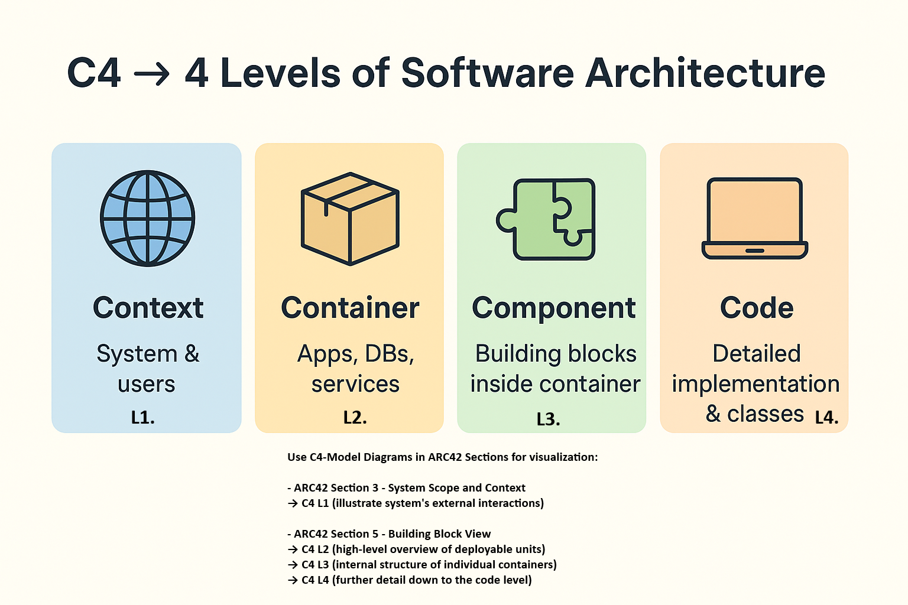

**© 2025 Hamadi Sy. All Rights Reserved. Unauthorized distribution or reproduction is strictly prohibited.**

---

# 🚀 C4 Model Essentials for Architecture Visualization

## Description
C4 Model 80/20-Principle based Cheat Sheet: Solve 80% of your daily architecture visualization needs. For Full-Stack Developers.

---

## 🎯 Purpose
The C4 model provides a hierarchical approach to software architecture visualization, allowing teams to communicate technical designs at different levels of abstraction.

---

## 🌱 Origin
The name stands for Context, Container, Component, and Code – the four levels of diagrams it defines. It was created by Simon Brown, a software architect, in the mid-2000s, stemming from his frustration with traditional UML diagrams being too complex or too simplistic for effective software architecture communication.

---

## 🧠 Essentials

### C4-Model levels

Focus on understanding and contributing to following core sections:
Source: [Link to C4-Model documentation](https://c4model.com/)

1️⃣ **System Context Diagram (Level 1)**
- What to know: Shows the software system as a black box in the middle, surrounded by its users and other software systems it interacts with.
- Why it's essential: Provides the highest-level view, crucial for understanding the overall scope, boundaries, and how your system fits into the enterprise landscape. It answers: "What is the system?" and "Who uses it?".

2️⃣ **Container Diagram (Level 2)**
- What: Zooms into the system context, showing the system's major "containers" (e.g., web application, mobile app, API gateway, database, message queue). These are separately deployable units.
- Why: This level is vital for fullstack developers as it illustrates how different parts of the system are deployed and interact (e.g., front-end talks to back-end API, which talks to a database). It's key for understanding responsibilities and team boundaries.

3️⃣ **Component Diagram (Level 3)**
- What: Zooms into a single container, showing the major components within it (e.g., controllers, services, repositories within a web application).
- Why: Essential for understanding the internal structure of a specific application or service you are working on. It helps in designing new features, refactoring existing code, and understanding dependencies within a single deployable unit.

4️⃣ **Code Diagrams (optional)**
- What: Code: the lowest level, showing implementation details like classes and interfaces, often generated from the code itself.
- Why: a visual way of code documentation.

### 🧩 C4-Model integration in ARC42
Using the hierarchical C4 diagrams to fulfill specific sections of the ARC42 doc, provides clear visual representations at different levels of detail.

- **ARC42 Section-3 (System Scope and Context)** 
  → maps directly to the **C4 Level-1 Diagrams**, illustrating the system's external interactions.

- **ARC42 S-5 (Building Block View)** 
  → can incorporate the **C4 Level-2 Diagrams** for a high-level overview of deployable units, 
  → the **C4 Level-3 Diagrams** to detail the internal structure of individual containers.  
  → Further detail down to the code level  **C4 Level-4 Diagrams** can be referenced or generated within this section as needed.

### 📊 'Diagrams as Code' Approach
- What: Create C4 diagrams using text-based languages (e.g. PlantUML) that can then be rendered into visual diagrams.
- Why: This approach keeps diagrams version-controlled with your code, automates diagram generation, and ensures consistency. As a developer, you'll often interact with these text files directly.
- How: **[C4-PlantUML Lib](https://github.com/plantuml-stdlib/C4-PlantUML)**   
  → the most common & definitive PlantUML open-source library for drawing C4 models.  
  → Provides a set of simple, intuitive macros that directly correspond to the elements of the C4 model (Person, System, Container, Component, etc.).  
  → By including the appropriate `.puml` file from the library, you can use these macros to create C4 diagrams without having to define the visual elements from scratch. This makes creating and maintaining diagrams as code fast and consistent.  
