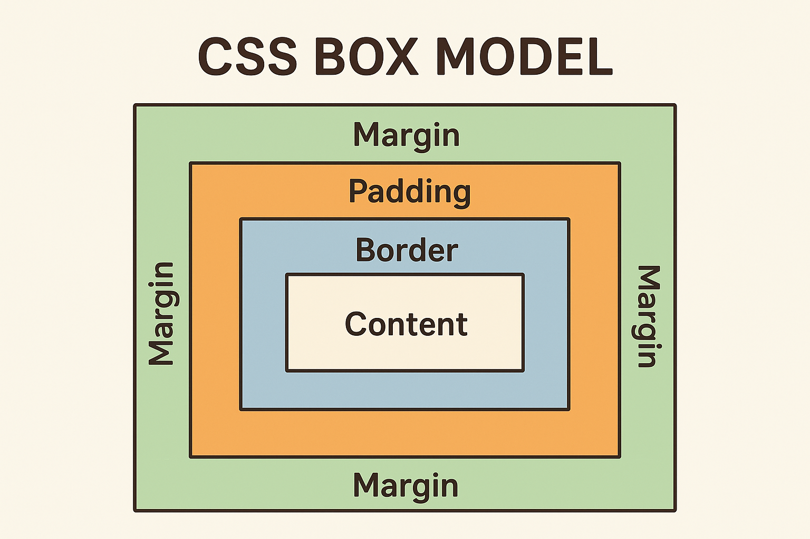

**© 2025 Hamadi Sy. All Rights Reserved. Unauthorized distribution or reproduction is strictly prohibited.**

---

## 🚀 80/20 Principle: The Essential 20% of CSS for Full-Stack Web-Developers to cover 80% of their daily tasks

---

# 🎯 Purpose
Controls the **style and layout** of HTML elements (colors, fonts, spacing, positioning).

---

# 🌱 Origin
Introduced by **Håkon Wium Lie** in **1996**.  
Name = *Cascading Style Sheets* → describes how styles “cascade” from multiple sources.

---

# 🧠 Essentials

→ [CSS Documentation: developer.mozilla.org/en-US/docs/Web/CSS](developer.mozilla.org/en-US/docs/Web/CSS)

## 🎨 Selectors
```css
/* Select by element: */ p { color: blue; }
/* Select by class: */ .myClass { background: yellow; }
/* Select by id: */ #myId { font-size: 24px; }
```

## 🎨 Colors & Backgrounds
* **Examples**
```css
.myClass { background: linear-gradient(to right, red, orange); }
body { 
  background-color: #f0f0f0; 
  color: #333; 
}
```
* **RGB (Red, Green & Blue)**: a color model where these 3 primary colors of light are combined in various intensities to create a wide spectrum of colors on screens. `#f0f0f0 = rgb(240, 240, 240)`

## 🔤 Text & Fonts
```css
h1 {
  font-family: Arial, sans-serif;
  font-size: 20px;
  text-align: center;
  line-height: 20px;
  text-decoration: underline;
}
```

## 📏 Box Model
  

```css
div {
  width: 200px;
  border: 2px solid black;
  padding: 10px; /* inside (Protects content) */
  margin: 20px; /* outside (moves box away from others)*/
}
```

## 🔗 Links & Buttons
```css
a {
  color: blue;
  text-decoration: none;
}
a:hover { text-decoration: underline; }

button {
  padding: 10px 20px;
  background: green;
  color: white;
  border: none;
  border-radius: 5px;
}
```

## 📐 Layout (Flexbox & Grid)
```css
.flex_container { /* Flexbox */
  display: flex;
  justify-content: space-between;
  align-items: center;
  flex-direction: column; /* vertical stack  */
}

.grid_container { /* Grid */
  display: grid;
  grid-template-columns: 1fr 2fr;
  gap: 10px;
}
```

## 🧩 Reusability 
```css
:root {
  --main-color: teal; /* define variable */
}

.btn { 
  background-color: var(--main-color); /* use variable */
}
```

## 📍 Positioning
```html
<div class="static">Static</div>
<div class="relative">Relative</div>
<div class="absolute">Absolute</div>
<div class="fixed">Fixed</div>
<div class="sticky">Sticky</div>
```

```css
.static { position: static; background: gray; }
.relative { position: relative; top: 10px; left: 10px; background: teal; }
.absolute { position: absolute; top: 10px; left: 220px; background: crimson; }
.fixed { position: fixed; top: 10px; right: 10px; background: orange; }
.sticky { position: sticky; top: 0; background: purple; }
div { width: 100px; height: 50px; color: white; margin: 10px; display: flex; align-items: center; justify-content: center; }
 ```

## ⚖️ Core CSS Units

1. `px` stands for **pixels**, a **fixed, absolute CSS unit**.
* `1px` = 1 dot on the screen (depends on device resolution).
* Does not scale with parent or root font size (Unlike `em` / `rem`).
* ✅ Use `px` when you need **fixed, exact sizing** (commonly for fonts, margins, borders, & layout).
* **Example:**
```css
p {
  font-size: 16px; /* exactly 16 pixels high */
  margin: 10px;    /* exactly 10 pixels spacing */
}
```

2. `em` is a **relative CSS unit** based on the **font-size of the parent element**. It stands for “M-width” of a typeface, referring to the width of the uppercase letter M in the current font.
* `1em` = 100% of the parent’s FS => `2em` = 2 × parent’s FS.
* ✅ Useful for **scalable, responsive sizing** of fonts, padding, and margins.
* **Example:**
```css
.parent { font-size: 16px; }
.child { font-size: 1.5em; } /* 16px × 1.5 = 24px */
```

3. `rem` stands for **“root em”** and is a **CSS unit relative to the root (`<html>`) font size**.
* `1rem` = 100% of the root FS (default is usually 16px in browsers). => `2rem` = 2 × root FS.
* Does not depend on the parent element (Unlike `em`).
* ✅ Great for **consistent sizing across the page and responsive design**.
* **Example:**
```css
html { font-size: 16px; }  /* root size */
p { font-size: 1.5rem; }   /* 16px × 1.5 = 24px */
```
