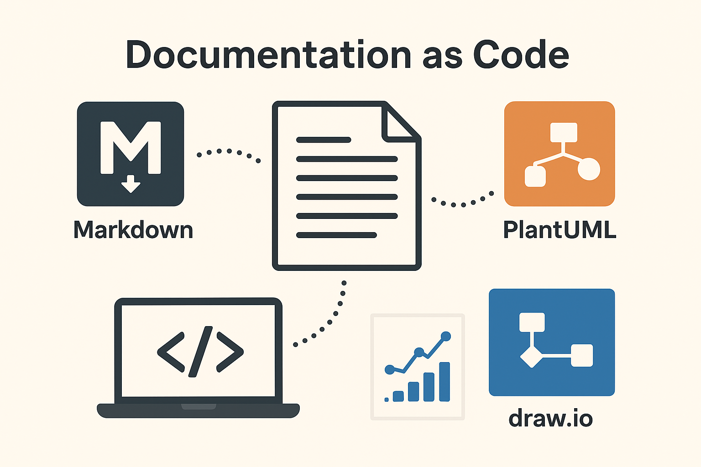

**© 2025 Hamadi Sy. All Rights Reserved. Unauthorized distribution or reproduction is strictly prohibited.**

---

## 🚀 80/20 Principle: The Essential 20% of Documentation As Code (DaC) for Full-Stack Web-Developers to cover 80% of their daily tasks

---

# 🎯 Purpose
Documentation as Code (DaC) treats documentation like source code, enabling version control, automation, and collaborative development.

# 🌱 Origin
While the core principles of treating documentation as code have evolved over time, the "Documentation as Code" movement gained significant traction with the rise of Agile methodologies and DevOps practices in the 2010s, with various practitioners advocating for its adoption rather than a single creator.

# 🧠 Essentials

## 🛠️ **PlantUML – Focus Areas (Text-Based Diagrams)**

1. **Important URLs**
- [PlantUml official website: plantuml.com](https://www.plantuml.com/)  
   → Defaultly opens the server renderer  
   → Click on Home in the Sidebar to view documentation  
- [PlantUml online editor: editor.plantuml.com](https://editor.plantuml.com/)  
   → Web editor without installation

2. **Versioning with Git**  
   → Store `.plantuml` files in repo for team collaboration.

3. **Tooling Integration**  
   → Use VS Code extension for PlantUML

4. **@startuml / @enduml structure**  
   → Every diagram starts and ends with these.

5. **Basic Diagrams:**  
   → Class diagrams, Sequence diagrams, Component diagrams, Deployment diagrams

6. **Include files / modular reuse**  
   → `!include common_styles.iuml`

7. **Use Lib for efficient drawing**  
   →  [C4-PlantUML Lib](https://github.com/plantuml-stdlib/C4-PlantUML)

---

## 🎨 **draw\.io – Focus Areas (Drag-and-Drop Visual Diagrams)**

1. **Important URLs**
- [Draw.io official website: app.diagrams.net](https://app.diagrams.net/?lang=en)  
   → Defaultly opens the web editor

2. **Versioning with Git**  
   → Store `.drawio` files in repo for team collaboration.

3. **Tooling Integration**  
   → Use VS Code extension for Draw.io

4. **Use Templates Efficiently**  
   → System, Network, UML, ERD templates cover most needs.

5. **Grid Layout & Layers**  
   → Align elements; group layers for complex diagrams.

6. **Export Options**  
   → PNG, SVG, PDF with embedded XML for future edits.

---

## ✅ **PlantUml vs. Draw.io, Which to Use When**

| Use Case                            | Tool         |
| ----------------------------------- | ------------ |
| Code versioning & text editing      | **PlantUML** |
| Auto-generated diagrams (from code) | **PlantUML** |
| Quick visual layout/mockup          | **draw\.io** |
| Interactive team brainstorming      | **draw\.io** |

---

## 📝 Markdown
[Markdown cheat sheet](./cheat-sheet-markdown.md)