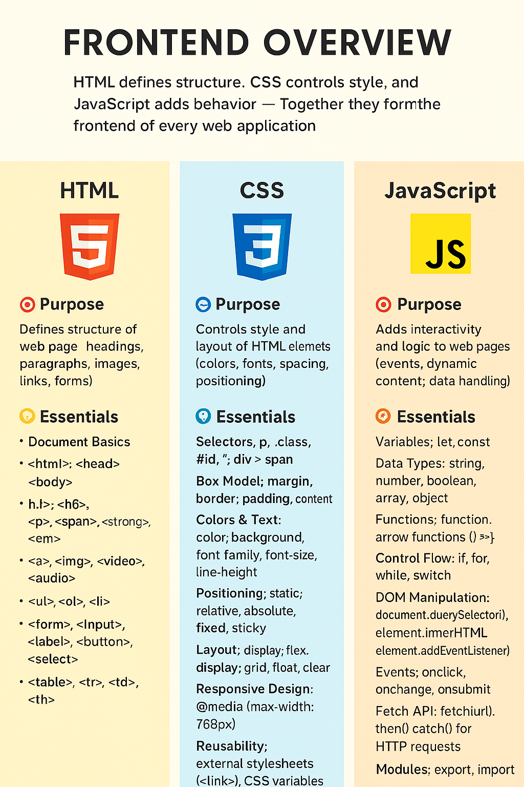

**© 2025 Hamadi Sy. All Rights Reserved. Unauthorized distribution or reproduction is strictly prohibited.**

---

# 🚀 HTML/CSS/Javascript Essentials as Core Web Frontend Techs

## Description
HTML/CSS/Javascript 80/20-Principle based Cheat Sheet: Solve 80% of your daily Web Frontend needs. For Full-Stack Developers.

---

## 🎯 Purpose
HTML defines **structure**, CSS controls **style**, and JavaScript adds **behavior** → Together they form the **frontend of every web application**.

---

## 🧠 Essentials

### 🧩 Quick Map
- [Web Documentation: developer.mozilla.org/en-US/docs/Web](developer.mozilla.org/en-US/docs/Web/) 

- **HTML** → What’s on the page  
→ [HTML Cheat Sheet](./cheat-sheet-HTML.md)  

- **CSS** → How it looks  
→ [CSS Cheat Sheet](./cheat-sheet-CSS.md) 

- **JavaScript** → How it works & reacts  
→ [Javascript Cheat Sheet](./cheat-sheet-Javascript.md)  

### 💻 Online Editors
- Great for **quick prototyping**, **learning by doing**, and **sharing code**.  
- Pros: No setup, instant preview, strong community.  
- Example: **CodePen** (https://codepen.io) – free, no login required for basic use, huge community.
