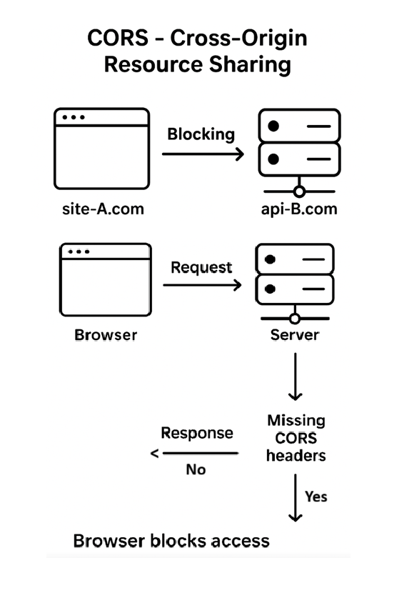

**© 2025 Hamadi Sy. All Rights Reserved. Unauthorized distribution or reproduction is strictly prohibited.**

---

# 🚀 Node.Js Essentials as Backend Runtime Environment

## Description
Node.Js 80/20-Principle based Cheat Sheet: Solve 80% of your daily Backend Runtime Environment needs. For Full-Stack Developers.

---

## 🎯 Purpose
- Javascript (JS) a programming language initially created to add dynamic & interactive features to static web pages. Build to run in browsers.  
- Node.js is a JS runtime built on Chrome’s V8 engine for running JS code server-side.  
- NVM (Node Version Manager) allows easy installation, switching, and management of multiple Node.js versions.

---

## 🌱 Origin
- Brendan Eich created JavaScript in 1995 for Netscape Communications. The name was probabely a marketing tactic by Netscape to leverage the popularity of the Java, despite the two being unrelated.  
- Node.js was created by Ryan Dahl in 2009, named for its modular "nodes" of functionality.  
- NVM was created by Tim Caswell in 2010, with the name directly describing its purpose: managing Node versions.  

---


## 🧠 Essentials


### ⚙️ Linux Installation
```bash
# Install NVM - Use installation guide versions https://github.com/nvm-sh/nvm
wget -qO- https://raw.githubusercontent.com/nvm-sh/nvm/v0.40.3/install.sh | bash
# Reload shell
exec $SHELL
# Verify NVM version:
nvm -v

# Install Node.js (LTS)
nvm install --lts

# Verify Node & NPM version
node -v
npm -v 
```

### 🛠 Useful NVM Commands
- `nvm ls` → List installed Node versions
- `nvm ls-remote` → List available Node versions
- `nvm current` → Show active version
- `nvm use 20` → Switch to Node version 18
- `nvm alias default 22` → Set default Node version
- `nvm uninstall <version>` → Remove a version
- To uninstall NVM & all Node.js versions on Ubuntu (double check and be carefull):
```bash
# Remove NVM directory containing all Node versions
rm -rf "$NVM_DIR"
# Find out current user´s shell
echo $SHELL
# Remove NVM environment references from user´s shell config (e.g. bash)
sed -i '/NVM_DIR/d' ~/.bashrc
# Remove any leftover Node binaries from PATH
sudo rm -rf /usr/local/{lib/node_modules,bin/node,bin/npm,bin/npx}
# Reload shell
exec $SHELL
```

### 📦 Package Manager
- [NPM official website: npmjs.com](https://www.npmjs.com/)Z
- **NPM**: is the default build-in Node.Js Package Manager used to install, manage, and share JavaScript libraries and tools.
- **Init Project**: `npm init -y`
- **package.json**
    * Project's manifest file, listing its details and dependencies.
    * *Example:* `{ "dependencies": { "express": "^4.18.2" } }`
    * Dependency version ranges using standard SemVer (`MAJOR.MINOR.PATCH`)
        * Caret (^): latest minor/patch >= version
        * Tilde (~): latest patch >= version
        * Exact (no special character): exact version
- **package-lock.json**
    * Locks exact versions of all dependencies to ensure consistent installations across different environments.
    * *Example:* It guarantees `express` is version `4.18.2` no matter what.
- **node_modules folder**
    * Holds all the actual code for project's dependencies.
    * *Example:* It contains the `express` folder with all the framework's files.
- **Install Package**: `npm install <pkg>` (local), `npm install -g <pkg>` (global)
- **Remove Package**: `npm uninstall <pkg>`
- **List Packages**: `npm list --depth=0` (local), `npm list -g --depth=0` (global)
- **Run Scripts**: `npm run <script>` (from package.json)
- **Audit & Fix**: `npm audit` → `npm audit fix`
- **Check outdated packages**: `npm outdated`
- **Update to safe versions**: `npm update`

### Express
- [Express Web Framework: expressjs.com](https://expressjs.com/)
- Unopinionated (no rigid rules on usage), minimal and fast web framework for Node.js
- Provides tools and functions to manage server setup, HTTP Requests/Routing ...

### CORS - Cross-Origin Resource Sharing
- 
- **CORS**: Security feature in web browsers controling whether a website can request resources from different domains.
- **Blocking**: Website at *site-A.com* trying to access data from an API at *api-B.com* would be blocked by default without CORS.
- **Allow Access**: To allow access, server needs to send a special header `Access-Control-Allow-Origin` back to the browser.  
    → can be done with `Node.js/Express` and `app.use(cors());` 

### NodeMon Utility
- [Nodemon website: nodemon.io](https://nodemon.io/)
- Live reload Node.Js app on changes

### 🏃 Running Apps
```bash
node app.js         # Run JS script "app.js"
node -e "js code"   # Run JS Code in terminal
npm run start       # Run script "start" defined in package.json
```
