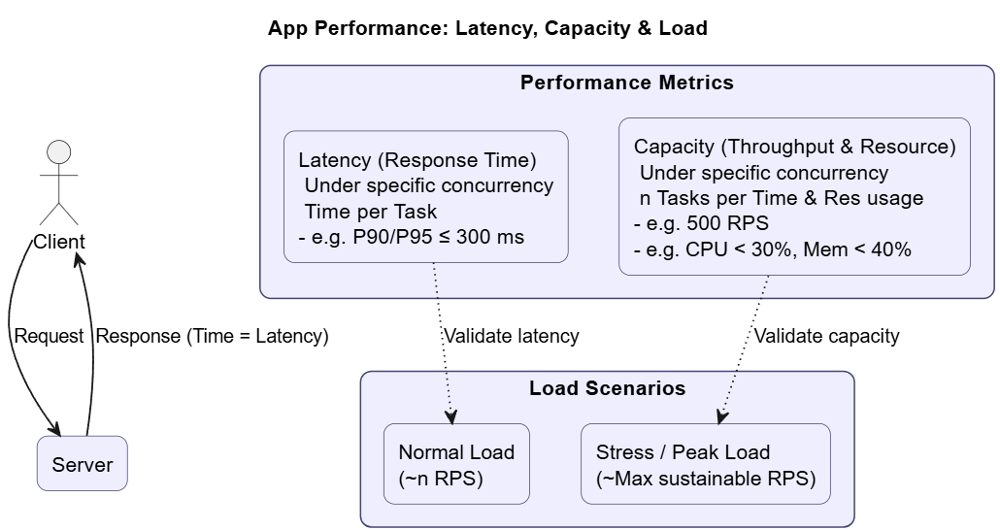

**© 2025 Hamadi Sy. All Rights Reserved. Unauthorized distribution or reproduction is strictly prohibited.**

---

# 🚀 Performance Testing Essentials for Web Apps

## Description
Performance Testing 80/20-Principle based Cheat Sheet: Solve 80% of your daily Performance Testing needs. For Full-Stack Developers.

---

## 🎯 Purpose
The purpose is to rapidly identify the major bottlenecks in an app's **response time** and **resource usage** under specific **load** conditions.

---

## 🌱 Origin
The Performance Testing Tool ab (Apache Bench) was created by Adam Twiss in 1996, and the modern, rate-controlled alternative hey, developed by Jaana Burcu Dogan (rakyll) in 2016.

---

## 🧠 Essentials

Focus on three areas: **Goals, Measurement, and Analysis.**



### **1. Core Performance NFR Types**

* **Latency (Response Time):** Ensuring the server responds quickly enough for the end-user. The target should be measured at the **P90 or P95 percentile** (e.g., 90% of requests must be $\le 300\text{ ms}$),  while the system is subjected to a specific concurrency level.
* **Capacity (Throughput & Resource):** Ensuring the system can handle the expected number of requests without running out of CPU or memory. **Key metrics** are **Requests Per Second (RPS)** and sustained **CPU/Memory** usage under target load.

### **2. Common Load Profiles**

* **Normal Load:** A controlled, low-to-moderate rate of requests matching typical daily usage (e.g., 2 RPS). Best for validating **Latency NFRs**.
* **Stress/Peak Load:** Pushing the system to its breaking point to find its maximum sustainable RPS. Best for validating **Capacity NFRs** and finding bottlenecks.

### **3. Measurement Tools**

Two key CLI tools: one for speed (stress) and one for control (load).

| Tool | Focus | Use Case (80%) | Advantage |
| :--- | :--- | :--- | :--- |
| **`ab` (Apache Bench)** | **Speed & Throughput** | Finding the server's **absolute maximum RPS** (its breaking point). | Simple, ubiquitous, and fast. |
| **`hey`** | **Control & Pacing** | Simulating a **controlled, realistic load** using a defined **Rate Limit (RPS)**. | Precise control over the request rate (`-q`). |

---

### **4. Analysis Essentials**

Focus on two primary sources of data to diagnose issues:

* **Client-Side (Load Tool Output):** Check the **P90/P99 latency values** in the `hey` output to see if the NFRs are met.
* **Server-Side (System Monitor):** While the test runs, use `htop` or `watch` + `ps` on the server to ensure **CPU and Memory** remain below the defined limits.

---

### 🛠️ hey Hands-On

Usage of `hey` for controlled NFR verification because it allows rate limiting.

* **Step 1: Linux Installation**
[hey github repo](https://github.com/rakyll/hey)
```bash
# 1. Download the executable binary (use current link from github repo)
wget https://hey-release.s3.us-east-2.amazonaws.com/hey_linux_amd64 

# 2. Make it executable
chmod +x hey

# 3. Move it to a system path
sudo mv hey /usr/local/bin/

# 4. Verify
hey -h
```

* **Step 2: Run Backend and save its Process-Id**
```bash
# Open new terminal (T1) and change to BE dir
cd [workspace/backend]
# Run BE
node server.js

# Open new terminal (T2) and Save BE PID of Node.js server to variable
PID=$(pgrep -f "node server.js")
```

* **Step 3: Execute Load-Test using Performance NFR Params**
    - Response Time: P90 $\le 300\text{ ms}$
    - Resource Usage: CPU $\le 15\%$ and Mem $\le 300\text{ MB}$ under a load of 2 Concurrent Users for 10 minutes.
    - Simulation of a load of $\approx 1\text{ RPS}$ per user, totaling $600$ requests over $10$ minutes.
```bash
# -n 600: Total 600 requests
# -c 2: 2 concurrent workers (simulated users)
# -q 1: Rate limit of 1 query per second *per worker* (Total 2 RPS)
# -m POST: HTTP method
hey -n 600 -c 2 -q 1 -m POST http://localhost:3000/api/spin
```

* **Step 3: Resource usage Verification during Test Run**
```bash
# Go to T2 and Monitor (for 10min) CPU and Memory (RSS in KB: Resident Set Size, used physical mem)
watch -n 5 "ps -p $PID -o %cpu,%mem,rss"
# %CPU < 15%; RSS < 307200KB (300MB).
```

* **Step 4: Response Time Verification after Test Run**
- check latency distribution in `hey` output. `90% in [X] ms is le 300 ms`

---

### 🛠️ ab Hands-On

* **Step 1: Linux Installation**

```bash
# 1. Install
sudo apt install apache2-utils

# 4. Verify
ab -h
```

* **Same Steps as Tool hey**

- Only missing cmd option is `-q`