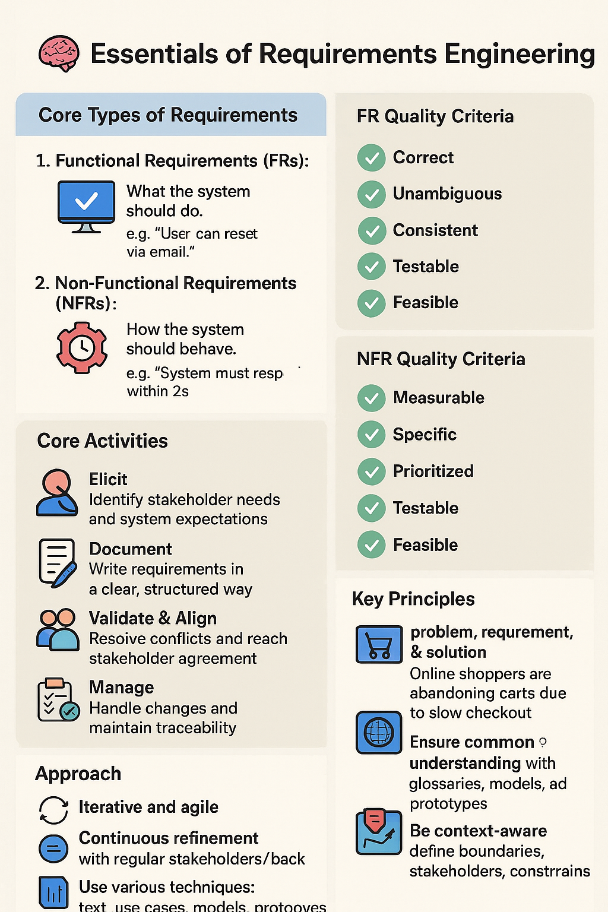

**© 2025 Hamadi Sy. All Rights Reserved. Unauthorized distribution or reproduction is strictly prohibited.**

---

# 🚀 Requirements Engineering Essentials for Software Planning

## Description
Requirements Engineering 80/20-Principle based Cheat Sheet: Solve 80% of your daily Requirements Engineering needs. For Full-Stack Developers.

---

## 🎯 Purpose
Systematically gather, document, validate, & manage system requirements to ensure shared understanding among stakeholders.

---

## 🌱 Origin
RE emerged in the 1960s from the "software crisis" driven by the need for clear project goals. Its importance was formalized at the 1968 NATO Software Engineering Conference, which advocated for a structured engineering approach to software development.

---

## 🧠 Essentials of RE

### 🧱 Core Types of Requirements
1. **Functional Requirements (FRs):** WHAT the system should do. e.g. “User can reset password via email.”
2. **Non-Functional Requirements (NFRs):** HOW the system should behave. Describe the quality attributes, constraints, & characteristics of the system. e.g. “System must respond within 2s.”

### ✅ FR Quality Criteria
* **Correct:** Accurately reflects a user need.
* **Unambiguous:** Has only one interpretation.
* **Consistent:** Does not contradict other requirements.
* **Testable:** Can be objectively verified.
* **Feasible:** Realistic and achievable.

### ✅ NFR Quality Criteria
* **Measurable:** Quantifiable (e.g., "within 2 seconds").
* **Specific:** Precise, detailing the "how well."
* **Prioritized:** Ranked by importance.
* **Testable:** Can be objectively verified.
* **Feasible:** Realistic and achievable.

### ⚙️ Core Activities
1. **Elicit** – Identify stakeholder needs and system expectations.
2. **Document** – Write requirements in a clear, structured way. Keep it brief & use Visuals help.
3. **Validate & Align** – Resolve conflicts and reach stakeholder agreement.
4. **Manage** – Handle changes and maintain traceability.

### 🔑 Key Principles
* Clear separation of **problem, requirement, & solution**. e.g.
    - **Problem:** Online shoppers are abandoning carts due to slow checkout.
    - **Requirement:** Checkout must complete in under 2 seconds.
    - **Solution:** Use a NoSQL database and a dedicated payment microservice.
* Ensure **common understanding** with glossaries, models, & prototypes.
* Be **context-aware**: define boundaries, stakeholders, & constraints to understand the env & the relevant factors.

### 🗺️ Approach
* Iterative & agile, not linear.
* Continuous refinement, with regular stakeholder feedback. Treat as living artifacts.
* Use various techniques: text, use cases, models, and prototypes.
