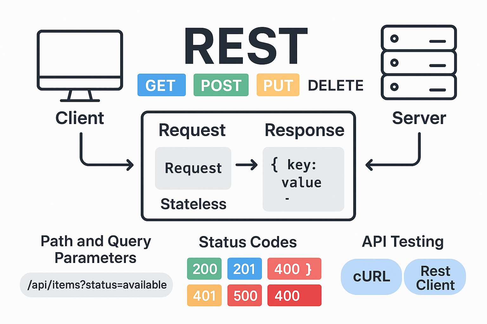

**© 2025 Hamadi Sy. All Rights Reserved. Unauthorized distribution or reproduction is strictly prohibited.**

---

## 🚀 80/20 Principle: The Essential 20% of REST for Full-Stack Web-Developers to cover 80% of their daily tasks**

---

# 🎯 Purpose
REST (Representational State Transfer) is an architectural style for designing web APIs that use standard HTTP (Hypertext Transfer Protocol) methods to enable communication between clients and servers.

---

# 🌱 Origin
REST was introduced by **Roy Fielding** in his 2000 doctoral dissertation. The name reflects transferring a “representation” of resources (data) via stateless client-server communication.

---

# 🧠 Essentials
[Doc: developer.mozilla.org/en-US/docs/Web/HTTP](https://developer.mozilla.org/en-US/docs/Web/HTTP)



---

## 🔗 Resources & Endpoints
* Resources are represented by **URLs - Uniform Resource Locator** (nouns, not verbs).
* **Example**: `GET https://jsonplaceholder.typicode.com/posts`

---

## ⚡ Core HTTP Methods
* **GET** → Read
* **POST** → Create
* **PUT** → Update
* **DELETE** → Remove

---

## 📦 Request & Response Format
* Mostly **JSON** (sometimes XML). Configured on server & sent as header param.
* **Example Response:** `{ "id": 12, "name": "Bob", "email": "bob@example.com" }`

---

## 📜 Status Codes
* `200 OK` → Success
* `201 Created` → New resource created
* `400 Bad Request` → Invalid input
* `401 Unauthorized` → Not correctly authenticated
* `403 Forbidden` → No access permission
* `404 Not Found` → Resource missing
* `500 Internal Server Error` → Server issue

---

## ⚖️ Statelessness
* Each request contains all necessary info (server does not remember previous requests).
* **Auth Token Example:** Included in headers every time. → `Authorization: Bearer <token>`

---

## 🔑 Path and Query Parameters  

- **Path Params**: Identify a specific resource, part of the URL.  
  → *Example:* Fetch user with ID 123.  
  → `GET /users/123`
- **Query Params**: Add filters, options, or pagination.  
  → *Example:* Fetch page 2 of users with role **admin**.  
  → `GET /users?role=admin\&page=2`

---

## 🔍 Testing APIs  

* [Free Fake REST API - jsonplaceholder.typicode.com](https://jsonplaceholder.typicode.com/)


### With Extension REST Client for VS Code:
* Create file `request.http` with following content:
```bash
### 🔹 GET (read a resource)
GET https://jsonplaceholder.typicode.com/comments
#GET https://jsonplaceholder.typicode.com/comments?postId=1

### 🔹 POST (create a resource)
POST https://jsonplaceholder.typicode.com/posts
Content-Type: application/json

{
  "title": "foo",
  "body": "bar",
  "userId": 1
}

### 🔹 PUT (update a resource)
PUT https://jsonplaceholder.typicode.com/posts/1
Content-Type: application/json

{
  "id": 1,
  "title": "updated title",
  "body": "new content",
  "userId": 1
}

### 🔹 DELETE (remove a resource)
DELETE https://jsonplaceholder.typicode.com/posts/1
```
* Click **"Send Request"** above each call inside VS Code.

### With cURL (client URL):
* cURL: command-line tool for transferring data with URL syntax from or to servers.
```bash
# 🔹 Install cURL if not yet installed:
sudo apt update; sudo apt install curl

# 🔹 GET (read a resource)
curl -X GET https://jsonplaceholder.typicode.com/posts

# 🔹 POST (create a resource)
curl -X POST https://jsonplaceholder.typicode.com/posts \
  -H "Content-Type: application/json" \
  -d '{"title":"foo","body":"bar","userId":1}'

# 🔹 PUT (update a resource)
curl -X PUT https://jsonplaceholder.typicode.com/posts/1 \
  -H "Content-Type: application/json" \
  -d '{"id":1,"title":"updated title","body":"new content","userId":1}'

# 🔹 DELETE (remove a resource)
curl -X DELETE https://jsonplaceholder.typicode.com/posts/1
```

---

## 🔒 Security Basics
* Use **HTTPS** to ensure data is encrypted, secure, and protected from eavesdropping or tampering.
* Authentication with **API keys**, **JWT**, or **OAuth2**.

---

## ⚡ Common Pitfalls
* ❌ Missing `Content-Type: application/json` header when sending JSON.
* ❌ Using wrong HTTP method (`GET` instead of `POST`, etc.).
* ❌ Forgetting authentication tokens or API keys.
* ❌ Hardcoding values instead of parameterizing requests.
- ❌ Mixing them up param types → Use **Path Params** for identity, **Query Params** for filtering/options.  
- ❌ Forgetting to **URL-encode** values (`?q=hello world` → `?q=hello%20world`).  
- ❌ Adding sensitive data (e.g., passwords, tokens) in query params — use headers/body instead.  
- ❌ Using too many query params instead of designing clear endpoints.  

