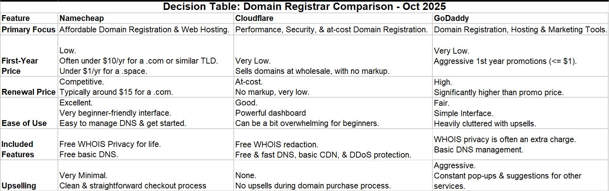

**© 2025 Hamadi Sy. All Rights Reserved. Unauthorized distribution or reproduction is strictly prohibited.**

---

# 🚀 Registrar Essentials for Domain Registration

## Description
Registrar 80/20-Principle based Cheat Sheet: Solve 80% of your daily Domain Registration needs. For Full-Stack Developers.

---

## 🎯 Purpose
Domain registration is the process of reserving a unique name on the internet to provide a human-friendly address for your website or application.

---

## 🌱 Origin
Namecheap was founded in 2000 by Richard Kirkendall. The company's name reflects its core mission to provide domain names at a very affordable price, offering a cost-effective alternative to other registrars.

---

## 🧠 Essentials

### Domain Registrar Comparison

### DNS Key Concepts & Workflow
- **Domain Name System (DNS):** Think of the DNS as the internet's phonebook. It translates human-readable domain names (like `google.com`) into IP addresses (like `23.34.45.56`) that computers use to find each other.
- **DNS Records:** These are the specific entries within the DNS that tell the internet where to send traffic for your domain.
  - **A Record:** The most common record. It maps a domain or subdomain name to an IPv4 address. This is what you'll use to point your domain to your VPS.
  - **CNAME Record:** Used to create an alias, mapping a subdomain to another domain name instead of an IP address.
  - **NS Record:** Specifies the authoritative name servers for the domain. You'll typically use Namecheap's default name servers.
- **Propagation:** When you update DNS records, it takes time for the changes to propagate across the internet's servers. This can take anywhere from a few minutes to up to 48 hours.

### Subdomains vs. Subdirectories - Web Projects Organization
- Subdomain: A separate domain name that is prefixed to your main domain: e.g. `blog.example.com`. 
It is treated as an independent website and requires its own DNS record to point to a server.

- Subdirectory: A folder or path located within your main domain: e.g. `example.com/blog`. 
It is part of the same website and shares the same DNS record and server as the root domain.

### Step-by-Step Configuration at Namecheap
Here are the steps to configure your domain `tecsa-acd.com` and subdomain `wof.tecsa-acd.com` to point to your DigitalOcean droplet at `[droplet-ip]`.

1.  **Log In and Navigate to Your Domain List:** In your Namecheap account, go to the "Domain List" and find `tecsa-acd.com`.
2.  **Go to Advanced DNS:** Click "Manage" next to your domain, and then navigate to the "Advanced DNS" tab.
3.  **Delete Conflicting Records:** Delete any existing A or CNAME records that might conflict with your new settings (e.g., records for `@` or `www`).
4.  **Add A Record for Main Domain:**
    * **Type:** A Record
    * **Host:** `@` (This represents the root domain `tecsa-acd.com`)
    * **Value:** `[Your DigitalOcean Droplet IP]`
    * **TTL:** Automatic
5.  **Add A Record for Subdomain:**
    * **Type:** A Record
    * **Host:** `wof` (This will create the subdomain `wof.tecsa-acd.com`)
    * **Value:** `[Your DigitalOcean Droplet IP]`
    * **TTL:** Automatic
6.  **Optional: Add CNAME for `www`:**
    * **Type:** CNAME Record
    * **Host:** `www`
    * **Value:** `tecsa-acd.com`
    * **TTL:** Automatic
7.  **Save Changes:** Click the checkmark to save each new record. It may take some time for the changes to become active.