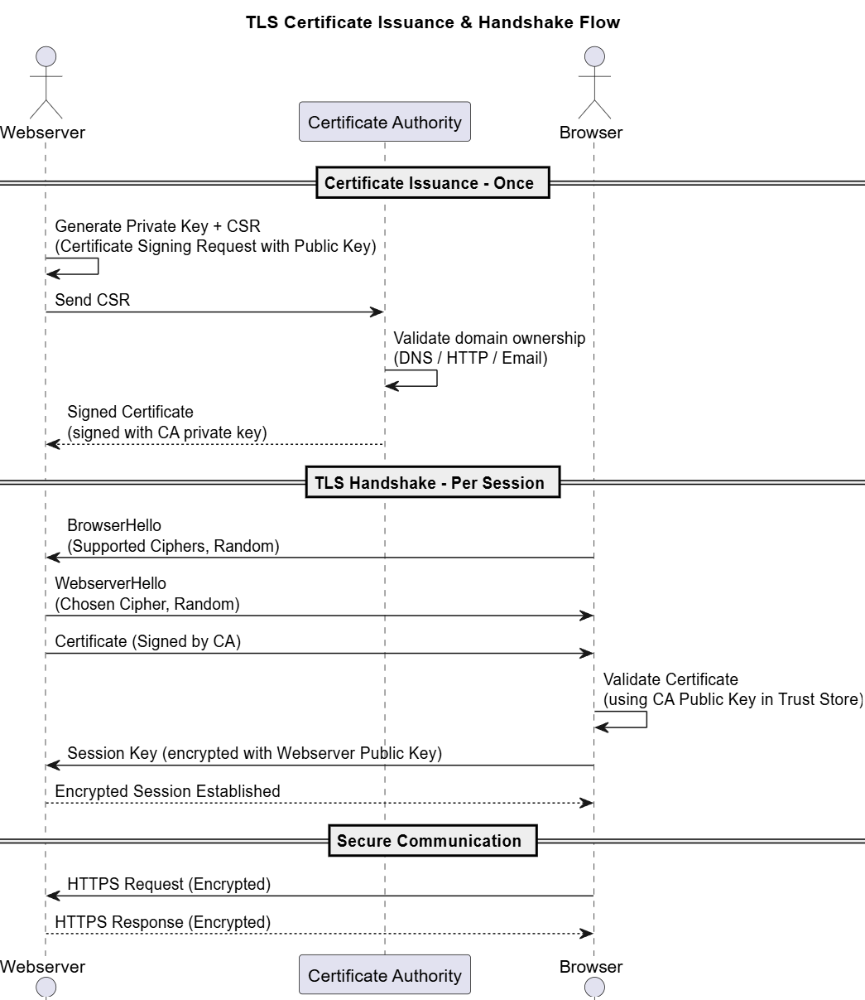
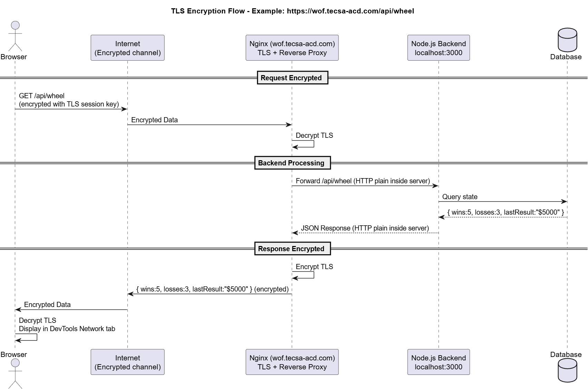

**© 2025 Hamadi Sy. All Rights Reserved. Unauthorized distribution or reproduction is strictly prohibited.**

---

# 🚀 TLS/HTTPS Essentials for securing web frontends

## Description
TLS/HTTPS 80/20-Principle based Cheat Sheet: Solve 80% of your daily Web Frontend Security needs. For Full-Stack Developers.

---

## 🎯 Purpose
SSL/TLS encrypts communication between clients & servers to ensure confidentiality, integrity, & authenticity of data over the internet.

---

## 🌱 Origin
SSL (Secure Sockets Layer) was created by Netscape in 1994.  
TLS (Transport Layer Security), its successor, was first standardized by the IETF in 1999 as a more secure and efficient version.  
The term "TLS" is now the correct standard, though "SSL" is still widely used.  

---

## 🧠 Essentials

### HTTP vs. HTTPS (The Problem)
Data exchanged over **HTTP** between Browser &  Website's Server is in plain, readable text. Anyone on the network, such as a hacker on a public Wi-Fi network or an internet provider, can read this data.  
With **HTTPS = HTTP + TLS**, data turned into scrambled code (encrypted) that is unreadable to anyone who intercepts it. 
  

--- 

### 🔑 Certificates
- Digital files proving a server's or domain's identity.
- Issued by Certificate Authorities (CAs), e.g., Let's Encrypt, DigiCert.
- Contain public keys used for encryption.

---

### 🏛️ Handshake
- Client and server exchange certificates and agree on encryption keys.
- Ensures secure communication before data transfer begins.
**Handshake workflow**
  

**Encryption Example**
  

---

### 🛠️ Common Tools
- **OpenSSL**: Generate keys, CSRs, and inspect certs.
- **Certbot**: Automate free TLS certificates with Let’s Encrypt.
Let's Encrypt is a free & automated CA that issues digital certificates to enable HTTPS on websites, making web encryption accessible to everyone.
[Let´s Encrypt](https://letsencrypt.org/)
[Certbot](https://certbot.eff.org/instructions)
```bash
# a. Install Certbot for Nginx
sudo apt update
sudo apt install certbot python3-certbot-nginx

# b. Request a Certificate
sudo certbot --nginx -d tecsa-acd.com -d www.tecsa-acd.com -d wof.tecsa-acd.com -d www.wof.tecsa-acd.com
# 👉 Certbot automatically: 
# 1. Send CSR to Let’s Encrypt and download certificates;
# 2. Identify matching server blocks under /etc/nginx/sites-available/
# 3. Enable TLS for each server block: listen to 443, add key paths
# 4. Redirect HTTP requests to HTTPS (if confirmed)
# 5. Test and reload webserver

# c. Test Automatic Renewal - certs are valid for 90days with auto-renewal
sudo certbot renew --dry-run
```

---

### 📆 Renewal
- Certificates expire (e.g., Let's Encrypt = 90 days).
- Automate renewal to avoid downtime.

---

### ⚠️ Pitfalls to Avoid
- Using self-signed certs in production.
- Forgetting renewal → site becomes inaccessible.
- Serving mixed content (HTTPS site loading HTTP resources).

