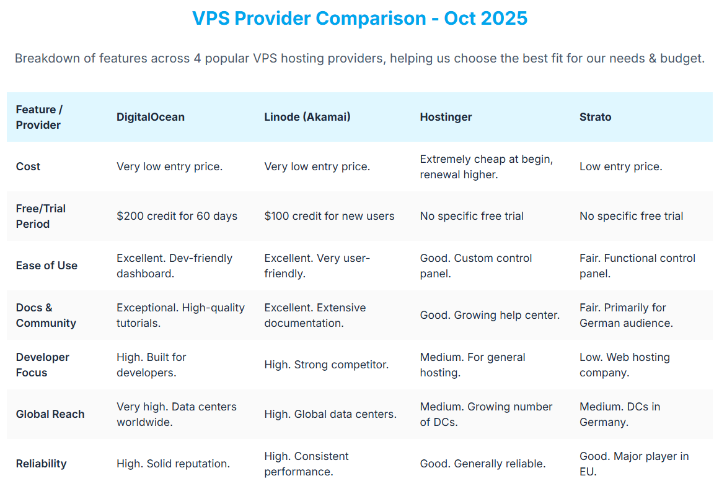

**© 2025 Hamadi Sy. All Rights Reserved. Unauthorized distribution or reproduction is strictly prohibited.**

---

## 🚀 80/20 Principle: The Essential 20% of Cloud VPS for Full-Stack Web-Developers to cover 80% of their daily tasks

---

# 🎯 Purpose
A Virtual Private Server (VPS) is a virtual machine sold as a service, providing developers with a dedicated, customizable environment to host their applications with full root access.

---

# 🌱 Origin
DigitalOcean was founded in 2011 by brothers Ben and Moisey Uretsky with the mission to simplify cloud infrastructure for developers, focusing on ease of use and a strong community.

---

# 🧠 Essentials - Key Concepts & Workflow

* The "Droplet": On DigitalOcean, a Droplet is your basic VPS instance. Creating one gives you a clean Linux server (e.g., Ubuntu) in minutes.

* SSH (Secure Shell) Access: key-based authentication protocol for secure remote login. Securely connect to your server using SSH (ssh user@your_ip_address) to install software and manage your application.

    - Step 1: Generate an SSH Key Pair
    `ssh-keygen -t rsa -b 4096`

    - Step 2: Copy your public key to the server
    `ssh-copy-id user@your_ip_address`

    - Step 3: Connect to your server
    `ssh user@your_ip_address`

    - Disable root login and use SSH key-based authentication.

* Deployment: `git pull` repo from GitHub directly onto VPS server.

* The Core Stack: You are responsible for the entire software stack. Our Setup
    - Runtime for your app (NVM/Node.js)

    - Database (MariaDB)
    ```bash
        # Install MariaDb
        sudo apt update; sudo apt install mariadb-server
        # Log in to mariadb shell
        sudo mariadb
        # Create and activate database
        CREATE DATABASE lucky_wheel_db;
        USE lucky_wheel_db;
        # Create table
        CREATE TABLE game_state (
            id INT AUTO_INCREMENT PRIMARY KEY,
            wins INT NOT NULL DEFAULT 0,
            losses INT NOT NULL DEFAULT 0,
            last_result VARCHAR(255)
        );
        # Verify table creation
        SHOW TABLES;
        DESCRIBE game_state;
        # Exit mariadb shell

        # add root password
        ALTER USER 'root'@'localhost' IDENTIFIED BY 'new_password';
        FLUSH PRIVILEGES;
        mariadb -u root -p

        # create and configure user
        CREATE USER 'your_user'@'localhost' IDENTIFIED BY 'your_password';
        GRANT ALL PRIVILEGES ON your_database.* TO 'your_user'@'localhost';
        FLUSH PRIVILEGES;
        # Remove insecure default settings
        sudo mariadb-secure-installation
    ```

    - Webserver Nginx Setup
    ```bash
    # 1. Install NginX
    sudo apt update; sudo apt install nginx;
    # Verify NginX is running. Status "active (running)"
    sudo systemctl status nginx
    2. Configure the Nginx Server Block in file `/etc/nginx/sites-available/wof`
server {
    listen 80;
    server_name [Instance_Ip]; 

    # Serve the static frontend files
    location / {
        root /var/www/wof; # contains Frontend files
        try_files $uri $uri/ /index.html; # pattern for single-page apps. Try to serve the requested file, then the directory, and finally falls back to index.html
    }

    # Reverse proxy backend API
    location /api {
        proxy_pass http://localhost:3000;
        proxy_set_header Host $host;
        proxy_set_header X-Real-IP $remote_addr;
        proxy_set_header X-Forwarded-For $proxy_add_x_forwarded_for;
        proxy_set_header X-Forwarded-Proto $scheme;
    }
}
    # Copy frontend files to /var/www/wof
    # Start Backend
    3. Enable Nginx Config by by creating a symb link from sites-available to  sites-enabled dir
    sudo ln -s /etc/nginx/sites-available/wof /etc/nginx/sites-enabled/
    4. Test and Restart Nginx
    sudo nginx -t # Test config for syntax errors
    sudo systemctl restart nginx # restart to apply changes
    5. Test remote browser connection: `http://[Instance_Ip]/` 
    ```


    - Firewall for Basic Security:
    UFW (Uncomplicated Firewall) cmd to open ports for our web server (80, 443) and SSH (22). 
    ```bash
        sudo apt install ufw
        sudo ufw default deny incoming
        sudo ufw default allow outgoing
        sudo ufw allow 'OpenSSH'
        sudo ufw allow 'Nginx Full'
        sudo ufw enable
    ```


* Provider Comparison

