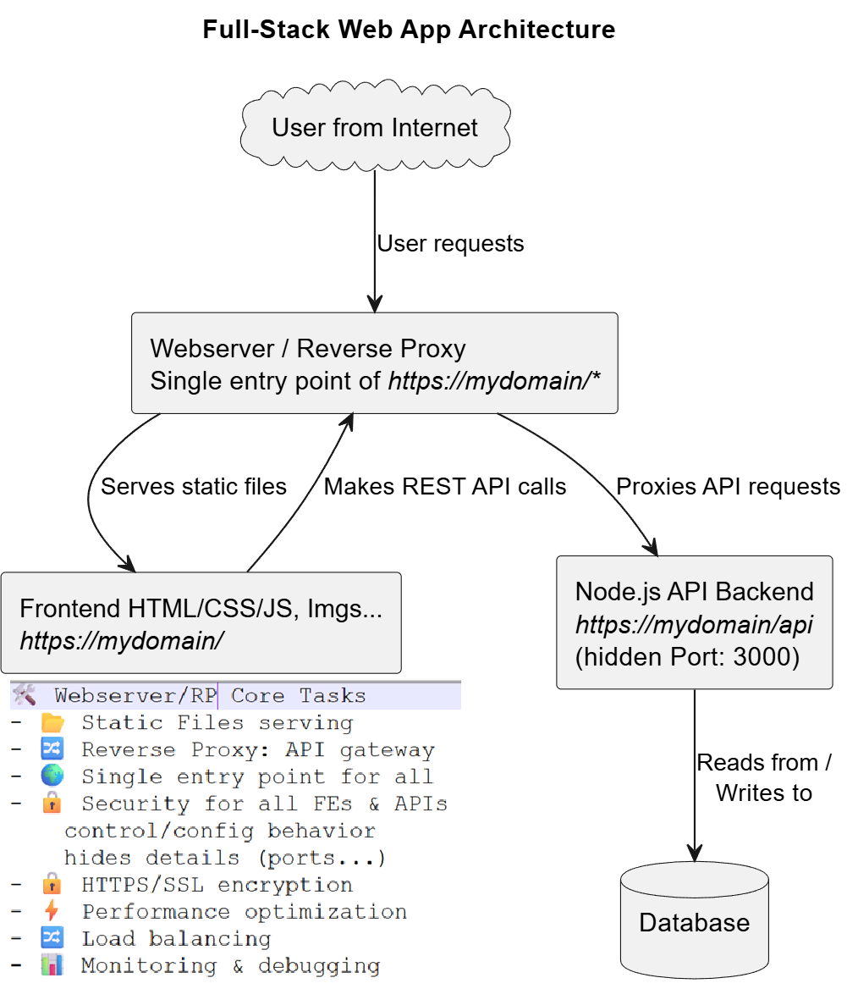
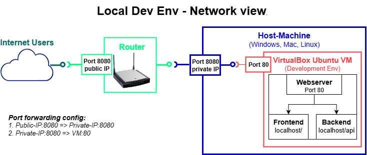

**© 2025 Hamadi Sy. All Rights Reserved. Unauthorized distribution or reproduction is strictly prohibited.**

---

## 🚀 80/20 Principle: The Essential 20% of Webserver for Full-Stack Web-Developers to cover 80% of their daily tasks**

---

# 🎯 Purpose

- A webserver delivers static web content (HTML, CSS, JS, Imgs) from server´s machine to client’s browser using HTTP/HTTPS.  
- A Reverse Proxy (RP) sits in front of backends running of servers´machine and forwards client requests to them.  
👉 Nginx and Apache can do both.

---

# 🌱 Origin

* **Apache HTTP Server**: Released in 1995 by the Apache Software Foundation; named from “a patchy server” due to its many patches.
* **Nginx**: Created in 2004 by Igor Sysoev in Russia to handle high concurrency and efficiency; name = “Engine X.”

---

# 🧠 Essentials



## 🛠️ Core Tasks of a Webserver  
- 📂 Serve static files (HTML, CSS, JS, images).  
- 🔒 Handle HTTPS/SSL encryption.  
- ⚡ Optimize performance (cache static content, compress responses, offload SSL/TLS).  
- 🔀 Load balancing: Distributes traffic across multiple backend servers.
- 📊 Log requests & errors for monitoring and debugging.  
- 🔀 Forward requests to backend apps (reverse proxy).  
- 🌍 Manage multiple sites/domains in one server (virtual hosts/server blocks).  
### ✅ Why we need a RP
- 🌍 Single entry point: One domain (e.g., https://wof.com) can serve both frontend (/) and backend (/api). Without it, you’d need different ports/domains.
- 🔧 Flexibility: Easy to swap or scale backend services without changing the frontend.
- 🔒 Security: Hides backend servers from the internet, only the RP is exposed.
- 👉 Without a RP, the frontend must know the exact address/port of the backend, you’d run into CORS issues, and managing multiple services becomes harder.


## 🔄 Host multiple sites on one server. 

* In `Apache` called `Virtual Hosts` and configured in config file `httpd-vhosts.conf`
  ```apache
  <VirtualHost *:80>
    ServerName example.com
    DocumentRoot /var/www/example
  </VirtualHost>
  ```
* `Nginx` called `Server Blocks` and configured in config file `/etc/nginx/sites-available/[configname]`
  ```nginx
  server {
    server_name example.com;
    root /var/www/example;
  }
  ```

## 📂 Serving Static Files
* Copy static files to Webserver deployment Directory, to serve them to browsers
* In `Apache` configured in Virtual Host with: `DocumentRoot "/opt/lampp/htdocs"`  
* In `Nginx` configured in Server Block with: `root /var/www/html;`  

## 🔀 Reverse Proxy
* Configure Proxy-Passing to forward requests to backend apps (Node.js, Python...).
* In `Apache` configured in Virtual Host with:
  ```apache
    ProxyPreserveHost On
    ProxyPass /api http://localhost:3000/api
    ProxyPassReverse /api http://localhost:3000/api
  ```
* In `Nginx` configured in Server Block with:
  ```nginx
    proxy_pass http://localhost:3000;
  ```

## 🔒 HTTPS / SSL Setup
Let's Encrypt is a free & automated Certificate Authority (CA) that issues digital certificates to enable HTTPS on websites, making web encryption accessible to everyone.

1. create certificate
```bash
# a. Install Certbot
sudo apt update
sudo apt install certbot python3-certbot-nginx  # Nginx
# OR
sudo apt install certbot python3-certbot-apache # Apache

# b. Request a Certificate
sudo certbot --nginx -d example.com -d www.example.com # Nginx
# OR
sudo certbot --apache -d example.com -d www.example.com # Apache
# 👉 Certbot: Obtains Let’s Encrypt certificate; Updates server config to use HTTPS and Reloads webserver.

# c. Test Automatic Renewal - certs are valid for 90days with auto-renewal
sudo certbot renew --dry-run
```

2. Configure webserver to use SSL certs

* Apache
  ```apache
  <VirtualHost *:443>
      ServerName example.com
      ServerAlias www.example.com
      SSLEngine on
      SSLCertificateFile /etc/letsencrypt/live/example.com/fullchain.pem
      SSLCertificateKeyFile /etc/letsencrypt/live/example.com/privkey.pem
  </VirtualHost>
  <VirtualHost *:80>
      ServerName example.com
      ServerAlias www.example.com
      Redirect permanent / https://example.com/
  </VirtualHost>
  ```

* Nginx
  ```nginx
  server {
    listen 443 ssl;
    ssl_certificate /etc/letsencrypt/live/example.com/fullchain.pem;
    ssl_certificate_key /etc/letsencrypt/live/example.com/privkey.pem;
  }
  server {
      listen 80;
      server_name example.com www.example.com;
      return 301 https://$host$request_uri;
  }
  ```

3. Verify in Browser
Open https://example.com → should show a padlock 🔒.

## ⚡ Performance Basics

* Enable caching (static assets).
* Use compression (gzip, Brotli).
* Prefer Nginx for high concurrency; Apache for flexibility & .htaccess.

## 📦 Apache deployment
* Make  
  → FE UI available on `http://localhost/`  
  → BE API available on `http://localhost/api/`

1. Enable virtual hosts extra config file
```bash
# Open file /opt/lampp/etc/httpd.conf
# Comment in following line (remove # at start)
Include etc/extra/httpd-vhosts.conf
```

2. Configure Apache Virtual Host
```bash
sudo nano /opt/lampp/etc/extra/httpd-vhosts.conf
#Add a VirtualHost with proxy rules
<VirtualHost *:80>
    ServerName localhost

    # Serve static FE files in htdocs/wof directly at http://localhost
    DocumentRoot "/opt/lampp/htdocs/wof"
    <Directory "/opt/lampp/htdocs/wof">
        Require all granted
        AllowOverride All
    </Directory>

    # Forward /api requests to Node.js backend on port 3000
    ProxyPreserveHost On
    ProxyPass /api http://localhost:3000/api
    ProxyPassReverse /api http://localhost:3000/api
</VirtualHost>
```

3. Copy frontend static files to DocumentRoot

4. Restart Apache
```bash
# Open XAMPP GUI
sudo /opt/lampp/manager-linux-x64.run
Start/Restart Apache
```

4. Fix URLs in FE code 
```bash
API_URL = 'http://localhost/api'
```

---

## 🌍 Internet access to web app running on local dev env

**Goal:** access FE UI over the internet using `http://[public-ip:8080/]`



1. Fix API_URL in FE to be '/api' (local is always the adr of the caller)
2. Configure following Port forwarding in virtual box:    
  → [host-private-ip:8080] → [vm-ip:80]   
  → host-private-ip can be found by running cmd `ipconfig /all` on Host-Machine   
3. Configure following Port forwarding in router admin panel:  
  → connect to router admin panel and find Port Forwarding section  
  → Add & save new rule [router-public-ip:8080] → [host-private-ip:8080]  

5. Test internet access to frontend  
  → Use mobile devive not connected to same network as host-machine  
  → Open http://[public-ip:8080/] in browser and play game  

6. Delete Port Forwarding configs after test (security)