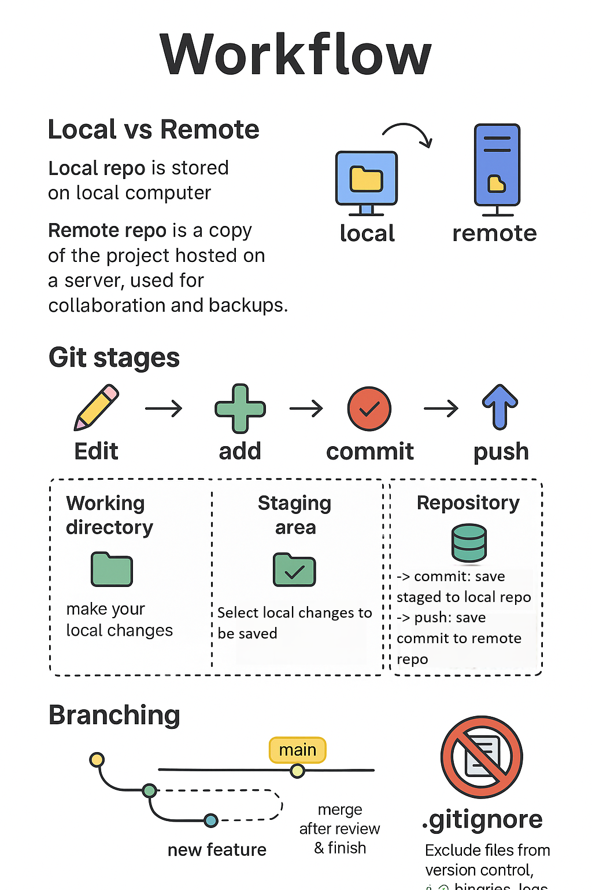

**© 2025 Hamadi Sy. All Rights Reserved. Unauthorized distribution or reproduction is strictly prohibited.**

---

## 🚀 80/20 Principle: The Essential 20% of GIT for Full-Stack Web-Developers to cover 80% of their daily tasks

---

# 🎯 Purpose
Git is an open-source version control system that tracks changes to files over time, allowing multiple people to collaborate on a project without overwriting each other's work.

# 🌱 Origin
Git has been created by Linus Torvalds, also the creator of the OS Linux. It´s a british slang term meaning a silly/unpleasant person. Torvalds jokingly called himself an "egotistical bastard" who names all his projects after himself. The first stable version was released on December 2005.

# ⚙️ Ubuntu Installation
```bash
sudo apt update; sudo apt install git
git --version
```

# 🔁 **Git Workflow**


* **Local vs Remote:**
  - Local repo is stored on local computer
  - Remote repo is a copy of the project hosted on a server, used for collaboration and backups.
* **Git stages:** Edit → `add` → `commit` → `push`
  1. Working directory: make your local changes
  2. Staging area: select which changes to save locally
  3. Repository
   - local repo: save permanently your local changes with a commit  
   - remote repo: save permanently your local changes on the remote repo with a push
* **Branching:** 
  - Git branch: separate & independent line of development within a project
  - Allows you to work on new features or bug fixes without affecting the main codebase.
  - Merge after review & finish
* **.gitignore** Exclude files from version control. e.g. binaries, logs, tmp files...


# 🔧 **Core Commands**

* `git init`
  → Initialize a local folder as local repository (repo)
  
* `git clone https://github.com/user/repo.git`
  → Clone a remote repo to your machine.

* `git add .`
  → Stage **all** changes for commit.

* `git commit -m "Add login feature"`
  → Commit staged changes with a message.

* `git push origin main`
  → Push local commits to the `main` branch on remote.

* `git fetch origin main`
  → Download latest changes of the branch `main` from remote repo `origin`.

* `git merge origin/main`
  → merge latest changes of the branch `main` from remote repo `origin` to current local branch.

* `git pull origin main`
  → Download & merge latest changes of the branch `main` from remote repo `origin` to current local branch.

* `git status`
  → See which files have changed.

* `git log @{u}..HEAD`
  → View all commits on current local branch, that are not yet on its upstream remote branch


* `git config --global --list` 
→ Display the global git configuration

# 🌿 **Branching**

* `git checkout -b feature/login`
  → Create & switch to a new feature branch.

* `git switch main`
  → Switch back to `main` branch.

* `git merge feature/login`
  → Merge feature branch `feature/login` into current local branch.

# 🧼 **Undo & Fixes**

* `git restore index.html`
  → Discard changes in `index.html`.

* `git reset --soft HEAD~1`
  → Undo last commit but keep the file changes.

# 🌐 **GitHub Integration**

* Create local Repo & Push to GitHub Remote Repo
  1.  **Create local repo:** Open terminal in local WS & run `git init`
  2.  **Stage Files:** Run `git add .` to stage all files for the first commit.
  3.  **Set user metadata: (optional, only once)** 
      - `git config --global user.email "you@example.com"`
      - `git config --global user.name "Your Name"`
  4.  **Commit Changes:** Run `git commit -m "Initial WoF commit"` to save a snapshot of current WS state.
  5.  **Create Remote Repo:** 
      - Login in to GitHub 
      - Create create a new, empty repo
      - Authenticate (e.g. using build-in VS Code GitHub Extension or using PAT)
  6.  **Connect local & remote Repos:** Run `git remote add origin <Github´s remote repo URL>`.
  7.  **Rename local main branch to (main) instead of master**: Run `git branch -M main`
  8.  **Push to GitHub:** Run `git push -u origin main` to push local files to the remote repo.

* Create a GitHub PAT (Personal Access Token) for Authentication
1. Why PAT instead of Passwords or SSH Keys:
- Granular Permissions
- Revocation & Expiration
- Auto Detection & Revocation on accidental commit
- High Entropy & Uniqueness
2. Log into GitHub & select Profile Picture → Settings → Developer settings → Personal access tokens → Tokens (classic)
3. Click `Generate new token` & select `Generate new token (classic)`
4. Configure Token
5. Click on `Generate token`
  → **Important:** Copy and save this now. You won't be able to see it again..
6. Use PAT in Git CMDs (e.g. while cloning)
  → When Git asks for credentials: Username → GitHub username; Password → PAT


* Manage **Pull Request (PR)** via GitHub UI.

# 👨‍💻**VS Code Integration**

* VS Code Git Integration in Project Explorer

* GitHub Authentication with Build-In GitHub Extension
- Auto sign in using browser and store login token in VS Code’s storage
- Stores credentials in the OS Keychain using build-in linux app `gnome-keyring`

* Sign out VS Code from GitHub
1. In the VS Code Activity Bar (left, below), click on 
  → Accounts  → <username> (GitHub)  → Sign Out 
2. Remove credentials from OS Keychain using GUI `seahorse` of `gnome-keyring`
- VS Code on Ubuntu uses `gnome-keyring` to store tokens, if no credential-helper.
```bash
# Open GUI
seahorse 
# In the `login` tab, remove entry of application `code`
```
3. Remove credentials from Git’s own config
```bash
git config --global --unset credential.helper
git credential-cache exit # clear any in-memory cache
```

# 🔒 **Security

* Git Credential Manager (GCM) is a superior choice for storing credentials:
- Use operating system's native secure credential storage
- Support for modern Auth Protocols (OAuth, PAT...) & GUI for Login
- Full support of Multi-Factor Auth
- Cross-Platform Consistency
```bash 
# Option 1 - use git-credential-manager to securely store credentials to OS Keychain
# Download installer and save to 
wget "https://github.com/git-ecosystem/git-credential-manager/releases/download/v2.6.1/gcm-linux_amd64.2.6.1.deb" -O /tmp/gcm.deb 
# Install
sudo dpkg -i /tmp/gcmcore.deb 
# (optinal) Update dependencies if errors occured during installation
sudo apt --fix-broken install -qq
# Configure credentials to be stored securely
git config --global credential.helper manager
git config --global credential.credentialStore secretservice
```

```bash
# Option 2 - store credentials in plain text in file ~/.git-credentials
git config --global credential.helper store`
```
* Remove credential storage method with following CMD
 → `git config --global --unset credential.helper`


---