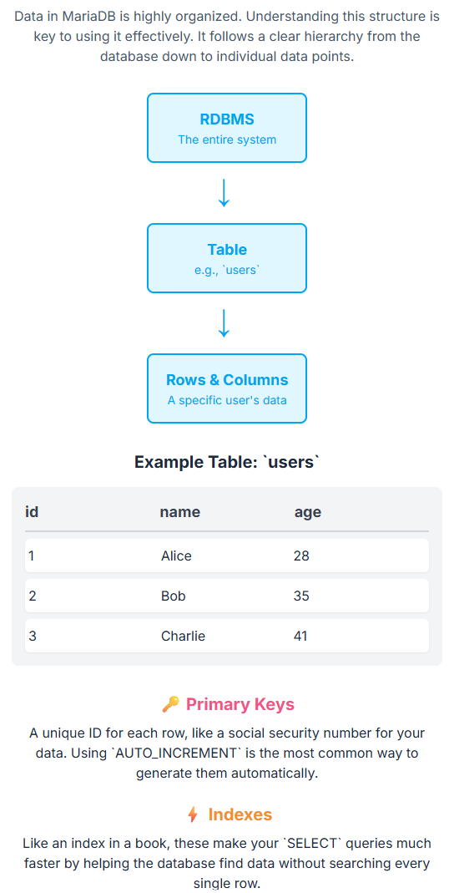
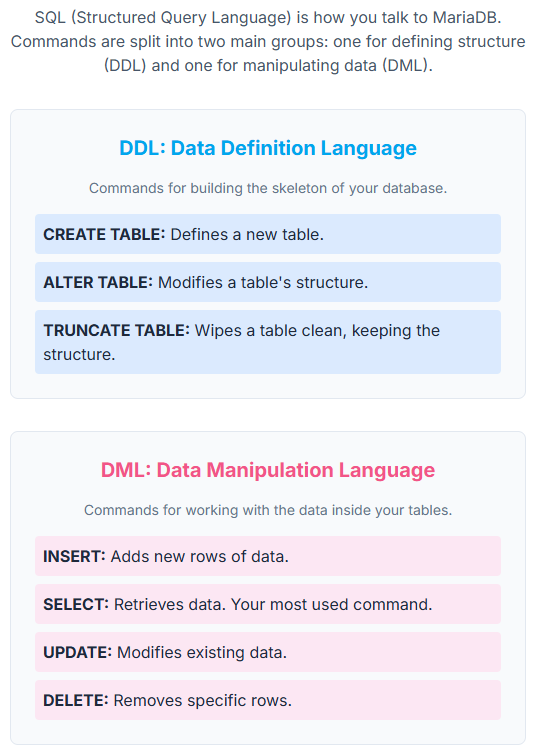

**© 2025 Hamadi Sy. All Rights Reserved. Unauthorized distribution or reproduction is strictly prohibited.**

---

# 🚀 MariaDb Essentials as SQL Database

## Description
MariaDb 80/20-Principle based Cheat Sheet: Solve 80% of your daily SQL Database needs. For Full-Stack Developers.

---

## 🎯 Purpose
MariaDB is a popular open-source Relational Database Management System (RDBMS) used for storing, managing, and retrieving structured data.

---

## 🌱 Origin
MariaDB is a community-developed fork of the MySQL relational DB, created by its original developers in 2009. The name comes from "Maria" the younger daughter of Michael Widenius, the founder of MySQL.

---

## 🧠 Essentials

### Database Concepts

* RDBMS: MariaDB organizes data into tables with predefined relationships


* Data Storage Structure: Tables, Rows (records), and Columns(fields)

* Common Data Types: INT, VARCHAR, TEXT, DATE, DATETIME, and BOOLEAN

* Primary Keys: A unique identifier for each row, essential for data integrity. AUTO_INCREMENT is a common attribute.

* Indexes: Use indexes to significantly speed up SELECT queries on specific columns.

* SQL Structured Query Language: standard language for managing and manipulating relational databases.


### SQL Queries  

DDL (Data Definition Language):

* CREATE TABLE: Defines the structure of a new table.
```sql
-- Create a table with a primary key and default values
CREATE TABLE game_state (
    id INT AUTO_INCREMENT PRIMARY KEY,
    wins INT NOT NULL DEFAULT 0,
    losses INT NOT NULL DEFAULT 0,
    last_result VARCHAR(255)
);
```

* ALTER TABLE: Modifies an existing table's structure.

* TRUNCATE TABLE: Deletes all data from a table, but keeps its structure.
```sql
TRUNCATE TABLE game_state;
```

DML (Data Manipulation Language):

* INSERT: Adds a new row of data.
```sql
-- Insert data into a table (using parameterized query syntax):
"INSERT INTO game_state (wins, losses, last_result) VALUES (?, ?, ?)", [gs.wins, gs.losses, gs.lastResult]
```

* SELECT: Retrieves data from one or more tables.
```sql
-- Select the most recent record
SELECT wins, losses, last_result FROM game_state ORDER BY id DESC LIMIT 1;
```

* UPDATE: Modifies existing data.
```sql
-- Update a specific record:
UPDATE game_state SET wins = wins + 1 WHERE id = 1;
```

* DELETE: Deletes specific rows.

```sql
DELETE FROM game_state WHERE wins < 10;
```
