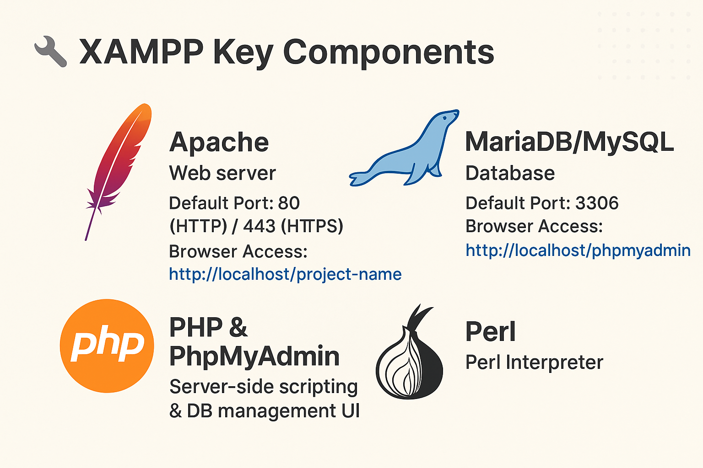

**© 2025 Hamadi Sy. All Rights Reserved. Unauthorized distribution or reproduction is strictly prohibited.**

---

## 🚀 80/20 Principle: The Essential 20% of XAMPP for Full-Stack Web-Developers to cover 80% of their daily tasks

---

# 🎯 Purpose
XAMPP is a cross-platform package bundling Apache, MariaDB/MySQL, PHP, and Perl, designed to quickly set up a web local development environment.

---

# 🌱 Origin
XAMPP was released on September 2002 by the non-profit project **Apache Friends**. The name is an acronym for it´s components: X (Cross-platform), A (Apache), M (MariaDB), P (PHP), and P (Perl).

---

# 🛠 XAMPP Key Components


- **Apache** – Web server
    - Default Port: 80 (HTTP) / 443 (HTTPS)
    - Browser Access: http://localhost/project-name
- **MariaDB/MySQL** – Database
    - Default Port: 3306
    - Browser Access: http://localhost/phpmyadmin
- **PHP & PhpMyAdmin** – Server-side scripting & DB management UI
- **Perl** – Perl Interpreter

# 🧠 Ubuntu Essentials

## 🔁 **Workflow**

* Install 
* Start services 
* Place files in `htdocs` 
* Test in browser 
* Manage DB in phpMyAdmin 
* Adjust config if needed.

--- 

## ⚙️ Installation
```bash
# Download linux installer "xampp-linux-x64-<version>-installer.run" from official website: https://www.apachefriends.org/download.html
sudo chmod +x xampp-linux-x64-<version>-installer.run
sudo ./xampp-linux-x64-<version>-installer.run

# Optional
# Avoid sudo for edits during development
sudo chown -R $USER:$USER /opt/lampp/htdocs
# Firewall config to open HTTP/HTTPS for remote access
sudo ufw status verbose # check status
sudo ufw allow 80/tcp # Allow HTTP
sudo ufw allow 443/tcp # Allow HTTPS
````

---

## ▶️ Basic Commands

```bash
sudo /opt/lampp/manager-linux-x64.run # Open XAMPP GUI
sudo /opt/lampp/lampp start           # Start all services
sudo /opt/lampp/lampp stop            # Stop all services
sudo /opt/lampp/lampp restart         # Restart all
```

---

## 📂 Key Paths 

* **XAMPP root**: `/opt/lampp/`
* **htdocs** (web root): `/opt/lampp/htdocs/`
* **php.ini**: `/opt/lampp/etc/php.ini`
* **Apache config**: `/opt/lampp/etc/httpd.conf`
* **Virtual hosts config**: `/opt/lampp/etc/extra/httpd-vhosts.conf`
* **MariaDB config**: `/opt/lampp/etc/my.cnf`
* **Error logs**: `/opt/lampp/logs/error_log`

---

## 🧪 Quick Test

Create file `info.php` in `/opt/lampp/htdocs/` with following content:

```php
<?php phpinfo(); ?>
```

Visit: `http://localhost/info.php`

---

## 🛡 Common Tips

* Run XAMPP as **non-root** in dev environments only.
* Change default MySQL root password in phpMyAdmin for security.
* Use **virtual hosts** for multiple projects:

```apache
<VirtualHost *:80>
  DocumentRoot "/opt/lampp/htdocs/project"
  ServerName project.local
</VirtualHost>
```

* Restart Apache after config changes.

---

## 🧰 Troubleshooting

* Port 80 in use? Change Apache port in `httpd.conf`.
* MySQL not starting? Check `/opt/lampp/var/mysql/*.err`.

---

